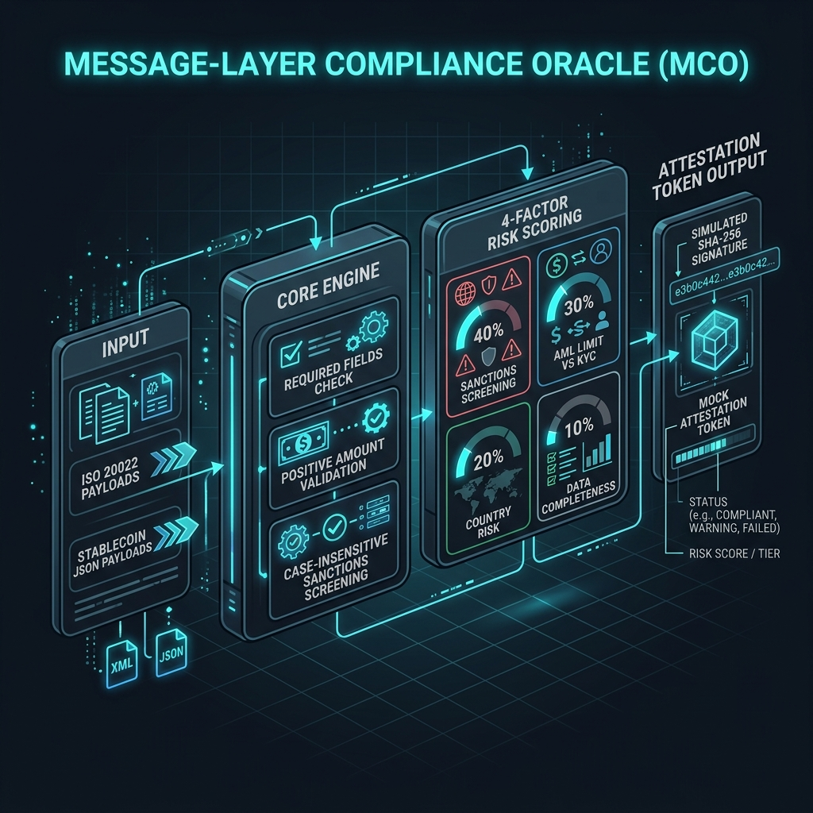

# Message-Layer Compliance Oracle (MCO)



MCO is an AI-native exploratory transaction compliance routing oracle. It targets multi-jurisdictional compliance semantic incompatibilities on ISO 20022 message layers and stablecoin settlement channels.

This project is concrete evidence generated as part of the **IdeaFirst AOX Standalone Loop** (Winner of Run `SA-AOX-20260521-002`).

## Directory Structure

```text
MCO/
├── .pgf/
│   ├── DESIGN-MCO.md        # PGF Gantree & PPR specifications
│   ├── WORKPLAN-MCO.md      # Milestone task roadmap
│   └── status-MCO.json      # Current implementation nodes status
├── docs/
│   └── ENGINEERING_GUIDE.md # Comprehensive engineering & design documentation
├── examples/
│   ├── sample_message.json  # Representative ISO 20022 payment payload
│   └── attestation_output.json # Resulting cryptographic mock attestation
├── spec/
│   ├── message_schema.yaml  # Data schemas for ISO 20022 & Stablecoin txs
│   ├── compliance_rules.yaml# AML threshold rules & sanctions lists
│   └── compliance_scoring_spec.md # Multi-dimensional risk score criteria
├── tools/
│   └── mco_oracle.py        # Executable compliance evaluation oracle
├── verification/
│   └── verify.py            # Automated integration test suite
├── requirements.txt         # PyYAML dependency specification
└── README.md
```

## How to Run

### Prerequisites
Install dependencies before running:

```bash
pip install -r requirements.txt
```

### Compliance Evaluation
Run the oracle script by providing rules, a transaction input, and an output destination:

```bash
python tools/mco_oracle.py spec/compliance_rules.yaml examples/sample_message.json examples/attestation_output.json
```

### Run Tests
Execute the automated integration test suite:

```bash
python verification/verify.py
```

### Bypass Tests
To bypass the verification tests (e.g. for rapid pipeline flow testing):

```bash
python verification/verify.py --bypass
```
